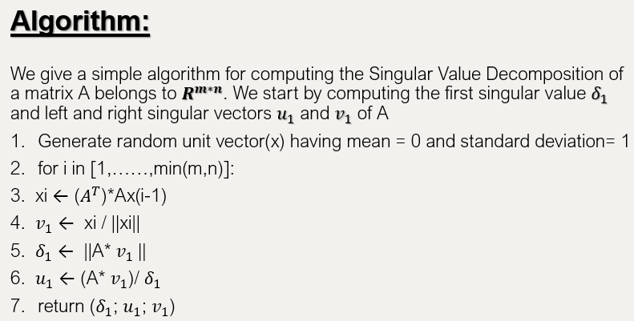

# SVD_ImageCompression #

### Main aim: Compressing image(using it’s pixels) by using SVD(Singular value Decomposition) for lossy image compression.
### Input image: Compress any format of image e.g. jpeg, jpg, bmp etc.
### Fundamental concept: SVD-based image compression scheme using a smaller number of rank to approximate the original matrix.
### Main method used: Power method - The pixels of the image are represented in the form of mxn matrix and SVD is performed on it.

## Implementation

## Algorithm

## Result

